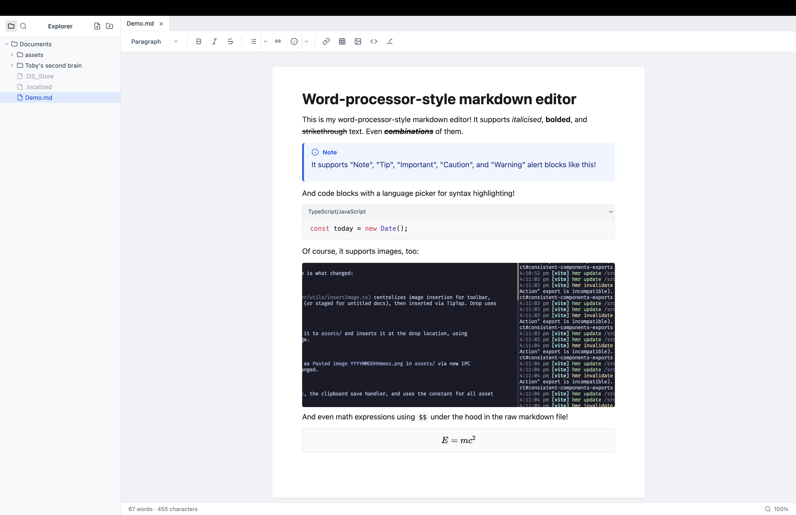

# Notebook

Notebook is an open-source, word-processor-style markdown editor. It's designed to abstract away the underlying Markdown syntax and give you an editing experience similar to mainstream word processors like LibreOffice, Microsoft Word or Google Docs.

It also supports opening a folder, which will show the file explorer, and provide you with a VSCode-inspired full workspace search, letting you find your search term across ALL markdown files in your open folder, and a fuzzy-find file searcher that lets you find a file in your open workspace by name.

Imagine... Obsidian, VSCode, and Microsoft Word had a baby... And it was open source... Here you go!



## Documentation

- [Architecture](docs/architecture.md) — process model, module layout, and conventions

## Developing

```bash
npm install

npm start
```
