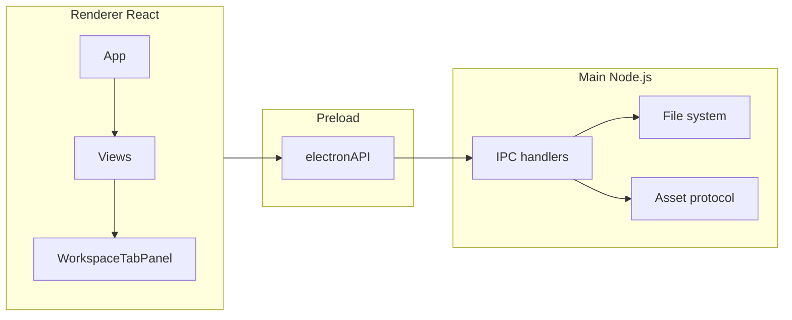
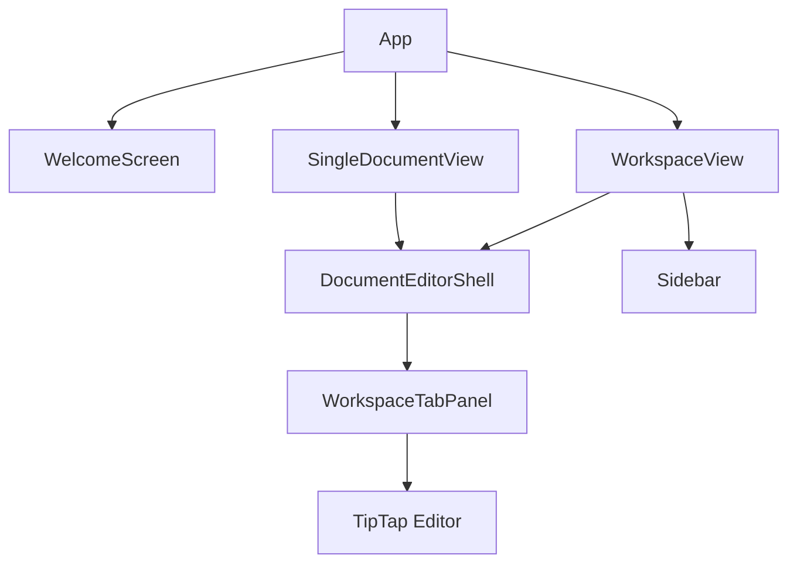
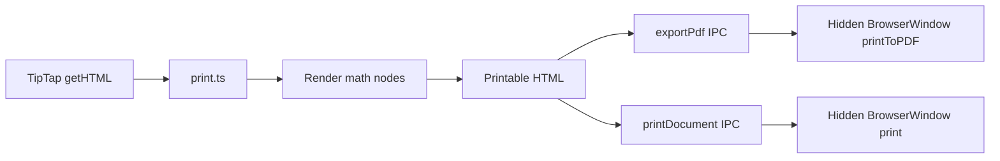

# Architecture

Notebook is an open-source, word-processor-style markdown editor built as an Electron desktop app. It presents Markdown through a WYSIWYG editing surface (TipTap) rather than raw syntax, and supports both standalone documents and folder-based workspaces with an explorer, full-workspace search, and multi-tab editing.

## Tech stack

| Layer | Technology |
|-------|------------|
| Desktop shell | Electron 44 |
| UI | React 19 |
| Editor | TipTap 3 (`@tiptap/react`, `@tiptap/markdown`, `@tiptap/starter-kit`) |
| Styling | Tailwind CSS 4, `@tailwindcss/typography` |
| Build | Electron Forge, Vite |
| File watching | Chokidar |
| Math rendering | KaTeX |

---

## Process model

Notebook follows the standard Electron three-process architecture:



**Renderer** — React application (`src/renderer/`). No Node.js or direct filesystem access.

**Preload** — [`src/preload.ts`](../src/preload.ts) exposes a curated `window.electronAPI` object via `contextBridge`. The renderer calls typed methods; the preload forwards them over IPC.

**Main** — [`src/main.ts`](../src/main.ts) handles window lifecycle, native menus, IPC handlers, filesystem operations, and the custom asset protocol.

### Security baseline

- `contextIsolation: true`, `nodeIntegration: false` on all `BrowserWindow` instances
- Renderer cannot access Node APIs or arbitrary filesystem paths
- Workspace file mutations validate path containment via [`src/shared/paths.ts`](../src/shared/paths.ts)
- External links open in the system browser; in-app navigation is denied

### Type flow

Shared IPC types live in [`src/shared/ipc-types.ts`](../src/shared/ipc-types.ts). The preload imports from there; the renderer re-exports via [`src/renderer/types/electron.d.ts`](../src/renderer/types/electron.d.ts) for `window.electronAPI` typing.

---

## Source layout

```
src/
├── main.ts                 # App bootstrap, windows, menu, IPC registration
├── preload.ts              # contextBridge → electronAPI
├── ipc/
│   └── channels.ts         # IPC channel constants + MenuAction, etc.
├── shared/
│   ├── appMeta.ts          # APP_NAME
│   ├── ipc-types.ts        # ElectronAPI interface + payload types
│   └── paths.ts            # Path containment + asset path validation
├── main/
│   ├── assets.ts           # Image pipeline, notebook-asset:// protocol
│   ├── folderOperations.ts # Workspace CRUD with path guards
│   ├── folderTree.ts       # Recursive directory reads (depth/entry limits)
│   └── folderWatcher.ts    # Chokidar watch with self-write suppression
└── renderer/
    ├── App.tsx             # Session router (welcome / single / folder)
    ├── main.tsx            # React entry
    ├── components/         # UI (see Component organization)
    ├── hooks/              # React state and side effects
    ├── editor/             # TipTap config, format commands, prose CSS
    ├── extensions/         # Custom TipTap extensions
    ├── contexts/           # React context (EditorTabContext)
    ├── styles/             # Design tokens + shared Tailwind class strings
    ├── types/              # workspace.ts, electron.d.ts
    └── utils/              # Markdown, print, search, paths helpers
```

---

## Application modes

[`App.tsx`](../src/renderer/App.tsx) routes the UI through a discriminated union:

| Mode | Component | Hook | Description |
|------|-----------|------|-------------|
| `welcome` | `WelcomeScreen` | — | Landing page, recent files/folders |
| `single` | `SingleDocumentView` | `useStandaloneTabs` | One or more documents without a workspace folder |
| `folder` | `WorkspaceView` | `useWorkspace` | Folder workspace with sidebar explorer and search |

Both document modes share:

- [`DocumentEditorShell`](../src/renderer/components/workspace/DocumentEditorShell.tsx) — TabBar, panel map, zoom, menu subscription
- [`WorkspaceTabPanel`](../src/renderer/components/editor/WorkspaceTabPanel.tsx) — TipTap editor instance per tab



---

## Renderer architecture

### Component organization

```
components/
├── shell/          WelcomeScreen, CommandPalette, StatusBar
├── workspace/      Sidebar, FileTree, TabBar, DocumentEditorShell, SidebarSearch
├── editor/         WorkspaceTabPanel, Toolbar, FindBar, NodeViews (Image, Code, Alert)
├── dialogs/        FormDialog + Link, Math, Table, NamePrompt, ImagePath dialogs
├── icons/          SVG icon sets (Toolbar, Explorer, Alert)
├── ContextMenu.tsx # Shared context menu (root level)
├── WorkspaceView.tsx
└── SingleDocumentView.tsx
```

### State management

There is no global store (no Redux/Zustand). State is layered:

| Layer | Module | Responsibility |
|-------|--------|----------------|
| Tab registry | `useTabManager` | Tab list, active tab, editor handle map, close/save menu handlers |
| Mode logic | `useWorkspace` / `useStandaloneTabs` | Explorer CRUD, preview tabs, folder watch (workspace); bootstrap (standalone) |
| Document lifecycle | `useTabDocument` | Dirty flag, queued images, save/save-as IPC |
| Menu routing | `useMenuActions` | Single subscription; dispatches to categorized handlers |
| Editor commands | `WorkspaceTabPanelHandle` ref | Menu → active panel (find, format, export) without prop-drilling the Editor |

Tabs keep a TipTap editor mounted (hidden via CSS when inactive). Each tab registers a `TabEditorHandle` so hooks can save/close without owning the editor instance.

### Editor stack

**Extension factory** — [`createEditorExtensions()`](../src/renderer/editor/editorExtensions.ts) composes StarterKit (with Link configured inline), custom extensions, Markdown round-trip, find-and-replace, and tables.

**Custom extensions** (`src/renderer/extensions/`):

| Extension | NodeView | Notes |
|-----------|----------|-------|
| `alertExtension` | `AlertView` | GitHub-style alert blocks with Markdown tokenizer |
| `codeBlockExtension` | `CodeBlockView` | Syntax highlighting via lowlight; plain-text override |
| `imageExtension` | `ImageView` | Local/remote images, drag-drop, repair UI |
| `mathExtension` | DOM node views | Block/inline KaTeX; click-to-edit via per-editor WeakMap |

**Per-tab image context** — [`EditorTabContext`](../src/renderer/contexts/EditorTabContext.tsx) provides `docPath`, asset resolver, and repair callbacks to `ImageView`. Each `WorkspaceTabPanel` wraps its editor in an `EditorTabProvider`.

**Format commands** — [`formatCommands.ts`](../src/renderer/editor/formatCommands.ts) holds toggle/insert helpers used by the toolbar. [`formatMenuActions.ts`](../src/renderer/editor/formatMenuActions.ts) maps menu actions to those commands plus export/print.

---

## Styling

Three layers, kept separate intentionally:

### App chrome

Tailwind utility classes composed in [`styles/ui.ts`](../src/renderer/styles/ui.ts): dialog shells, toolbar buttons, dropdown panels, z-index ladder, list row highlights. Components import named constants rather than repeating long class strings.

### Design tokens

[`styles/tokens.css`](../src/renderer/styles/tokens.css) defines CSS custom properties for app colors and alert palette. [`index.css`](../src/index.css) imports tokens and maps them into Tailwind v4 `@theme` so utilities like `bg-app-sidebar` and `text-app-muted` are available.

### Editor content

- Screen: `prose` class on `.editor-content` + overrides in [`editor-prose.css`](../src/renderer/editor/editor-prose.css)
- Print/export: plain CSS in [`editor-prose-print.css`](../src/renderer/editor/editor-prose-print.css), inlined alongside tokens by [`print.ts`](../src/renderer/utils/print.ts)

Editor NodeViews use `not-prose` where they need to opt out of typography plugin defaults.

---

## IPC and file system

### Channel naming

All channels are defined in [`ipc/channels.ts`](../src/ipc/channels.ts) using a `domain:verb` pattern (`file:save`, `folder:read-tree`, `menu:action`, etc.).

### Workspace operations

Create, rename, and delete within a workspace go through [`folderOperations.ts`](../src/main/folderOperations.ts), which validates entry names and asserts paths stay inside the workspace root.

Directory trees are read by [`folderTree.ts`](../src/main/folderTree.ts) with depth (12) and entry (5000) limits. Changes are watched by [`folderWatcher.ts`](../src/main/folderWatcher.ts) with debouncing and suppression of writes initiated by the app itself.

### Images and assets

- Saved images live in an `assets/` subdirectory next to the document
- Untitled documents stage images to a temp directory until first save
- Asset URLs use a custom `notebook-asset://` protocol registered in [`main/assets.ts`](../src/main/assets.ts)
- Relative asset paths are validated against `..` traversal; the protocol handler rejects paths outside allowed roots (temp dir, user home)

### Menu actions

Native menu items in the main process send `menu:action` events to the focused window. The renderer dispatches them through `useMenuActions` hooks in `App`, `DocumentEditorShell`, and tab manager hooks (save/close).

---

## Print and export



[`getPrintableHtml()`](../src/renderer/utils/print.ts):

1. Walks serialized HTML and renders KaTeX for block/inline math nodes
2. Wraps content in `<div class="editor-content">`
3. Inlines `tokens.css` and `editor-prose-print.css`

The main process opens a hidden `BrowserWindow` with the HTML as a `data:` URL for PDF generation or the system print dialog.

---

## Conventions for contributors

### Adding a menu action

1. Add the action string to `MenuAction` in [`ipc/channels.ts`](../src/ipc/channels.ts)
2. Add a menu item in `buildMenu()` in [`main.ts`](../src/main.ts)
3. Add to `EDITOR_FORMAT_ACTIONS`, `EDITOR_VIEW_ACTIONS`, or handle in tab manager hooks
4. Implement in [`formatMenuActions.ts`](../src/renderer/editor/formatMenuActions.ts) or the relevant view hook

### Adding a dialog

1. Create a thin wrapper around [`FormDialog`](../src/renderer/components/dialogs/FormDialog.tsx)
2. Use class constants from [`styles/ui.ts`](../src/renderer/styles/ui.ts) for inputs and labels

### Adding a TipTap block

1. Create the extension in `src/renderer/extensions/`
2. Add a React NodeView in `components/editor/` if needed
3. Register in [`createEditorExtensions()`](../src/renderer/editor/editorExtensions.ts)
4. Add prose rules to `editor-prose.css` and `editor-prose-print.css` if the block needs custom screen/print styling

### Adding IPC

1. Channel constant in [`ipc/channels.ts`](../src/ipc/channels.ts)
2. Request/response types in [`shared/ipc-types.ts`](../src/shared/ipc-types.ts)
3. Handler in [`main.ts`](../src/main.ts) (or a future extracted handler module)
4. Preload wrapper in [`preload.ts`](../src/preload.ts)
5. Path-sensitive operations should use helpers from [`shared/paths.ts`](../src/shared/paths.ts)

### Class merging

Use [`cn()`](../src/renderer/utils/cn.ts) (`clsx` + `tailwind-merge`) when combining Tailwind classes, especially when a shared constant might conflict with a conditional override.
